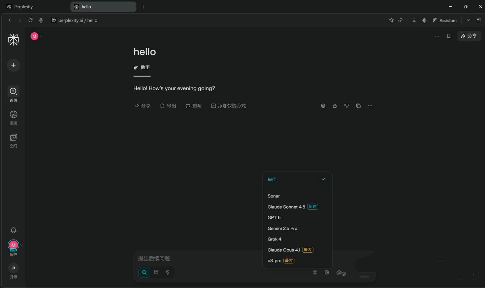
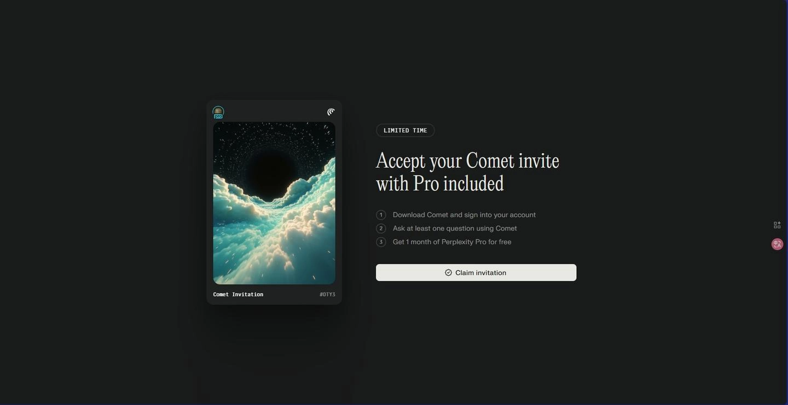

# 白嫖顶级AI模型？Comet浏览器送你一个月Perplexity Pro会员

---

你可能听说过GPT-5、Claude 4.5、Gemini 2.5 Pro这些名字，但要真正用上它们，要么得排队等内测，要么得掏不少钱。现在有个机会：**下载一个浏览器，用邮箱注册一下，这些顶级模型随便切换用**。

Comet AI浏览器最近开放了免费使用，之前这玩意儿一个月要200美元。更关键的是，注册就送**1个月Perplexity Pro会员**——不用绑卡，不用付费，就是白送。这意味着你能直接体验GPT-5、Claude Sonnet 4.5、Gemini 2.5 Pro和Grok-4这四个当前最强的AI模型。

---

## Perplexity Pro到底能干什么？

先说清楚，Perplexity不是搜索引擎，也不是聊天机器人。它更像是一个**AI模型的聚合平台**——把各家最强的模型接进来，让你随时切换使用。

### 四个顶级模型，随便切

Pro会员能用的模型包括：

- **OpenAI GPT-5**：据说是内测版本，比GPT-4o强不少
- **Anthropic Claude Sonnet 4.5**：Claude 4系列里的高效版，推理能力很强
- **Google Gemini 2.5 Pro**：支持复杂推理和多模态处理
- **xAI Grok-4**：马斯克团队做的，特点是实时性强，观点比较另类

这些模型在各自官方平台要么还没开放，要么得单独订阅。在Perplexity里，你可以一个问题问完，切换模型再问一遍，对比不同AI的回答风格。

### 直接生成图片

Perplexity Pro集成了Google最新的Nano Banana图像模型（也就是Gemini 2.5 Flash Image）。你可以直接用自然语言描述，让AI生成图片，不用再跳转到Midjourney或DALL·E。

### 深度研究和AI代理

- **Deep Research**：你提一个问题，AI会自动执行多轮搜索，交叉验证信息来源，最后生成一份结构化报告。适合写论文、做市场分析这类需要深度调研的场景。
- **Perplexity Labs**：实验性功能，能让AI主动完成一些小项目。比如你说"10分钟内搭建一个天气查询网页"，它真的会去做。

👉 [想体验这些顶级AI模型的实际效果？点这里直接领取](https://pplx.ai/ixkwood69619635)

---

## Comet浏览器：不只是个壳

Comet不是那种简单套个Chrome内核就拿出来卖的浏览器。它是专门为AI交互设计的，有几个实用功能：

- **右侧常驻AI助手**：浏览任何网页时，右边栏都有Perplexity助手，可以直接问当前页面的内容
- **Finance模块**：实时追踪加密货币和股票数据，适合关注二级市场的人
- **无缝迁移**：支持从Chrome导入书签、扩展和设置，换浏览器不用重新配置
- **跨平台**：Windows和macOS都能用

---

## 三步领取教程（建议用新邮箱）

**重要提示**：用一个没注册过Perplexity的邮箱，QQ邮箱或Gmail都行。

### 第一步：下载浏览器

1. 访问邀请链接：https://pplx.ai/hoangmaitr13463
2. 点击"Claim invitation"（接受邀请）
3. 输入邮箱，查收验证码并填写
4. 浏览器会自动开始下载（大约80-120MB）

### 第二步：安装并设置

1. 安装完成后打开Comet
2. 选择是否从Chrome导入数据（可选）
3. 设置用户名和头像，点Continue
4. 系统会自动跳转到Perplexity登录页，用同一个邮箱登录

### 第三步：激活Pro会员

1. 登录后随便问个问题（比如"今天有什么科技新闻？"）
2. 等30-60秒，刷新页面
3. 右上角出现"Pro"标识，就说明激活成功了

全程不用付费，不用绑卡，没有隐藏订阅。

---

## 为什么Perplexity值得信任？

Perplexity的投资方包括英伟达、软银和贝索斯的Expeditions基金。英伟达CEO黄仁勋公开说过他经常用这个产品。在OpenAI和Google还没完全开放最强模型的情况下，Perplexity通过聚合策略，给用户提供了**当前最灵活的顶级AI使用入口**。

---

## 窗口期有限，建议尽快体验

这种免费赠送活动通常不会持续太久。Perplexity Pro原价是20美元/月（约140元人民币），而且包含多个闭源模型的调用权限。无论你是学生、研究者、开发者，还是单纯对AI工具感兴趣，都值得花几分钟试试。

👉 [现在就领取你的Perplexity Pro会员，体验四大顶级AI模型](https://pplx.ai/ixkwood69619635)

如果这篇文章对你有帮助，可以分享给更多需要的朋友——让每个人都能平等地接触前沿AI技术。

*注：本文所述功能及模型版本基于2025年10月公开信息，具体可用模型可能随Perplexity官方策略动态调整。*
